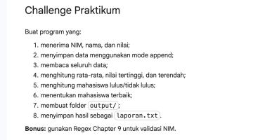
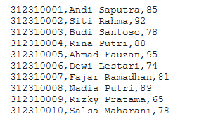
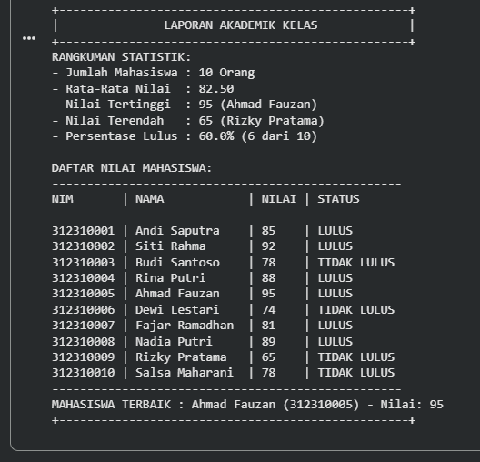

# Tugas (Pertemuan ke 3) 

|Nama|NIM|Kelas|Mata Kuliah|
|----|---|-----|------|
|**Radityatama Nugraha**|**312310644**|**I.23.1C**|**Automation System**|

# Latihan Soal:

# Nilai_Mahasiswa.Txt:

# Tampilan Output Laporan Akademik Kelas:

